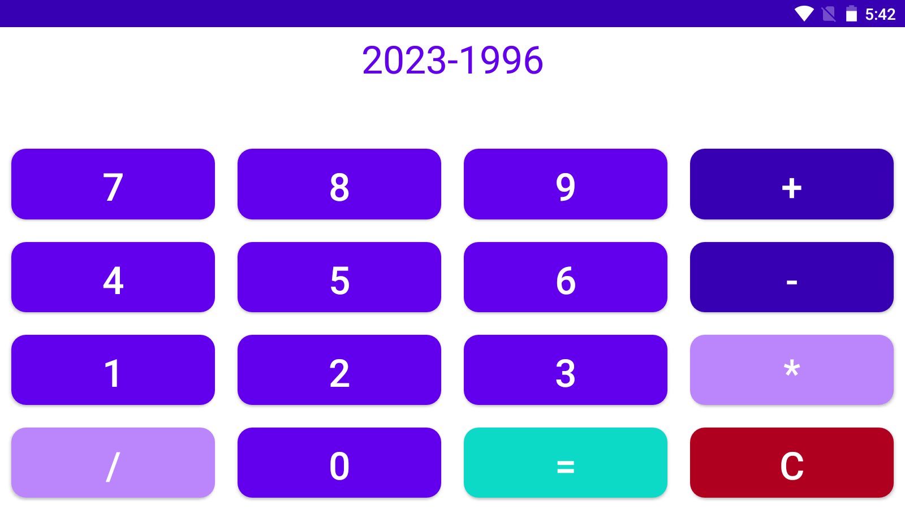

# Simple Android Calculator Application




A simple Android calculator app written in Java.

## Table of Contents

- [Introduction](#introduction)
- [Features](#features)
- [Requirements](#requirements)
- [Getting Started](#getting-started)
- [Usage](#usage)
- [Contributing](#contributing)
- [License](#license)

## Introduction

This project is a basic calculator app developed for Android devices using Java. The app provides essential mathematical operations and aims to be user-friendly.

## Features

- Addition, subtraction, multiplication, and division operations.
- Clear button to reset the input.
- User-friendly interface.

## Requirements

- Android Studio
- Android device or emulator

## Getting Started

1. Clone the repository:

```bash
git clone https://github.com/Aminsaffar/android-simple-calculator.git
```

2. Open the project in Android Studio.

3. Build and run the app on your Android device or emulator.

## Usage

1. Launch the app on your Android device.

2. Enter numbers using the on-screen keypad.

3. Perform mathematical operations by tapping the corresponding buttons.

4. Use the "C" button to clear the input.

## Contributing

If you'd like to contribute to this project, please follow these steps:

1. Fork the repository.

2. Create a new branch:

```bash
git checkout -b feature/your-feature
```

3. Make your changes and commit them:

```bash
git commit -m 'Add your feature'
```

4. Push to the branch:

```bash
git push origin feature/your-feature
```

5. Open a pull request.

## License

This project is licensed under the MIT License - see the [LICENSE](LICENSE) file for details.

---

